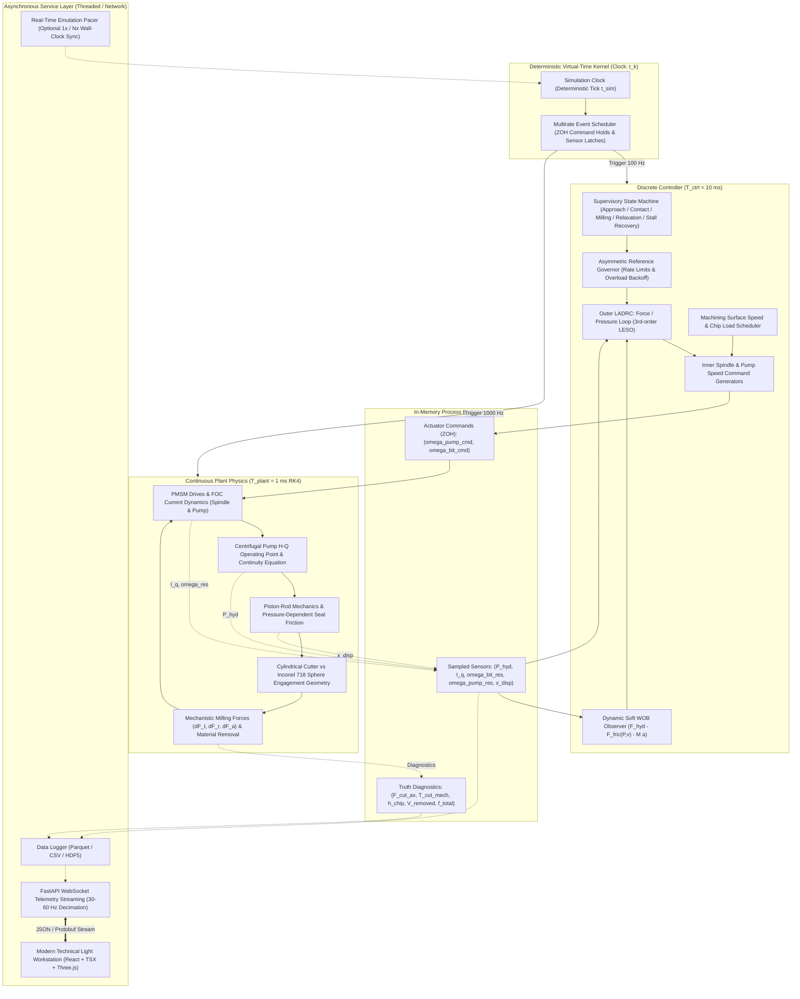

# Implementation Plan: Deterministic Virtual-Time Asymmetric Hydraulic Milling Simulator & Adaptive Control Workstation

Engineering blueprint for the development of a hybrid physics/data-driven milling simulator and adaptive control environment. The project models an asymmetric hydraulic pusher (centrifugal pump, compressibility, stiff bypass orifice, pressure-dependent seal friction) coupled to a PMSM spindle engaging an Inconel 718 spherical workpiece. The simulation core utilizes a deterministic virtual-time scheduler with explicit multirate sample periods and zero-order holds. The control hierarchy incorporates a Gain-Scheduled Baseline PID and a Cascade Linear Active Disturbance Rejection Controller (LADRC) with an Asymmetric Reference Governor and Soft WOB Observer. The web UI features a crisp, modern technical light research workstation aesthetic.

---

## User Review Required

> [!IMPORTANT]
> **Key Architecture & Methodology Refinements:**
> 1. **Deterministic Virtual-Time Scheduling**:
>    The numerical plant and discrete controller **never** free-run against OS wall-clock time. Instead, a deterministic virtual clock advances in lockstep with explicit sample rates:
>    - Plant integration: $\Delta t_{plant} = 1.0\text{ ms}$ (or $0.1\text{ ms}$ for tooth-resolved dynamics) via RK4.
>    - Discrete controller: $\Delta t_{ctrl} = 10\text{ ms}$ ($100\text{ Hz}$) with Zero-Order Hold (ZOH) on actuator commands.
>    - In-situ soft sensing: $\Delta t_{obs} = 1\text{ ms}$ to $10\text{ ms}$.
>    - Telemetry & UI publication: Decimated asynchronous stream at $30\text{ Hz}$ / $60\text{ Hz}$.
> 2. **Physical Hydraulic Operating Point**:
>    Pump RPM is not mapped to pressure via a transfer function. Pressure emerges from fluid continuity coupled to a nonlinear centrifugal head-flow ($H-Q$) map, bulk modulus $\beta_{eff}(P)$, piston displacement flow $A_p \dot{x}$, a stiff calibrated bypass orifice $Q_{bypass}(P)$, and parasitic seal leakage.
> 3. **Pressure vs. WOB & Nonlinear Seal Friction**:
>    Pressure is not treated as instantaneous WOB. The actual axial cutting force $F_{c, axial}$ is decoupled from cylinder pressure by rod inertia, structural compliance, and pressure-dependent Stribeck/LuGre seal friction:
>    $$M_{eff} \ddot{x} + C_{v} \dot{x} + F_{fric}(P, \dot{x}) + F_{c, axial} = P \cdot A_p$$
>    where seal contact friction scales nonlinearly with chamber pressure $P$.
> 4. **Mechanistic Milling of Inconel 718**:
>    Replaces empirical handbook formulas with a 3D mechanistic cutting model (Altintas formulation): cylindrical cutter envelope intersecting an evolving spherical workpiece $\to$ instantaneous uncut chip thickness $h(\theta) \to$ tangential, radial, and axial force vectors $\to$ spindle torque $T_c$ and axial load $F_{c, axial}$. Force coefficients are identified via staged DoE/SysID.
> 5. **Control System Libraries & Benchmark Hierarchy**:
>    - `python-control`: Foundational library for state-space formulations, discretization (ZOH/Tustin), frequency sweeps, and linear robustness margins.
>    - `adrc` / `pyadrc` evaluation: Standalone transparent discrete LADRC module implemented in-tree with bandwidth parameterization ($\omega_o, \omega_c$), augmented with an Asymmetric Anti-Windup Reference Governor, while supporting integration with external libraries.
>    - Staged comparison: Gain-scheduled PID baseline $\implies$ Cascade LADRC $\implies$ Constrained MPC $\implies$ MRAC.
> 6. **Modern Technical Light Aesthetic**:
>    Clean milling workstation UI: Off-white / light slate palette (`#f8fafc`, `#ffffff`, border `#e2e8f0`), deep cobalt blue accents (`#2563eb`), slate typography, and sharp vector charts for scientific reporting, academic battery research, technical documentation, and presentation-ready chart exports. Navigation via a dedicated left sidebar.

---

## System Architecture Diagram



---

## Mathematical Formulations

### 1. Hydraulic Circuit with Pressure-Flow Coupling & Bulk Modulus
- **Centrifugal Pump Operating Point**:
  The pump does not command pressure directly; it establishes an $H-Q$ curve parameterized by mechanical speed $\omega_p$:
  $$\Delta P_{pump}(\omega_p, Q) = \rho g H = a_0 \omega_p^2 - a_1 \omega_p Q - a_2 Q^2$$
  where $Q$ is forward volumetric flow. The pump has non-reversible check-valve behavior: $Q_{pump} \ge 0$ when $\omega_p \ge 0$.
- **Fluid Continuity in Forward Chamber**:
  The pressure rate is governed by fluid compressibility and chamber volumetric deformation:
  $$\frac{dP}{dt} = \frac{\beta_{eff}(P)}{V_0 + A_p x} \left( Q_{pump}(\omega_p, P) - Q_{bypass}(P) - Q_{leak}(P) - A_p \dot{x} \right)$$
- **Stiff Calibrated Bypass Orifice & Leakage**:
  $$Q_{bypass}(P) = C_{bypass} \sqrt{\frac{2}{\rho} |P - P_0|} \, \text{sgn}(P - P_0)$$
  $$Q_{leak}(P) = C_{leak} (P - P_0)$$
  where $C_{bypass}$ is small (stiff orifice), establishing a slow passive relaxation time constant $\tau_{leak} \gg \tau_{cut}$.
- **Effective Bulk Modulus with Entrained Air**:
  $$\frac{1}{\beta_{eff}(P)} = \frac{1}{\beta_{oil}} + \frac{\alpha_{air,0} \left(\frac{P_0}{P}\right)^{1/\gamma}}{P} + \frac{1}{K_{wall}}$$
- **Asymmetric Relaxation Mechanics**:
  When pump speed is reduced ($\omega_p \to \omega_{min}$), $Q_{pump} \to 0$. The chamber pressure can **only** discharge via:
  1. Material removal feed: $A_p \dot{x} > 0$ (fast active relaxation as the bit mills away target material).
  2. Parasitic orifice bypass: $Q_{bypass}(P)$ (very slow passive relaxation).
  $$\left. \frac{dP}{dt} \right|_{\omega_p=0} \approx -\frac{\beta_{eff}(P)}{V(x)} \left( Q_{bypass}(P) + A_p \dot{x} \right)$$

### 2. Axial Rod Dynamics & Pressure-Dependent Seal Friction
- **Equations of Motion**:
  $$M_{eff} \ddot{x} + C_v \dot{x} + F_{fric}(P, \dot{x}) + F_{c, axial} = (P - P_0) A_p$$
- **Pressure-Dependent Dynamic Stribeck / LuGre Friction**:
  Hydraulic seals expand against the cylinder wall proportionally to chamber pressure $P$:
  $$F_c(P) = F_{c0} + \alpha_{cp} P, \quad F_s(P) = F_{s0} + \alpha_{sp} P$$
  $$F_{fric}(P, \dot{x}) = \left( F_c(P) + \left(F_s(P) - F_c(P)\right) e^{-\left|\frac{\dot{x}}{v_s}\right|^\delta} \right) \text{sgn}(\dot{x}) + \sigma_v(P) \dot{x}$$
- **Soft Weight-On-Bit (WOB) Observer**:
  $$\hat{F}_{wob}(t) = (P(t) - P_0) A_p - \hat{F}_{fric}(P, \dot{x}) - M_{eff} \hat{\ddot{x}}$$

### 3. Mechanistic Milling Mechanics: Cylindrical Tool vs Inconel 718 Sphere
- **Engagement Geometry**:
  A cylindrical tool of radius $R_{bit}$ and $Z$ flutes advances along axis $x$ into an Inconel 718 sphere of radius $R_{sphere}$ centered at $(x_0, y_0, z_0)$.
  - Penetration depth: $d(t) = \max(0, x(t) - x_{contact})$.
  - Cutter axial immersion bounds: $z \in [z_{min}(d), z_{max}(d)]$.
  - Angular tooth engagement limits: $[\phi_{st}(z, d), \phi_{ex}(z, d)]$.
- **Instantaneous Chip Thickness**:
  For tooth $j$ at immersion angle $\phi_j(\theta) = \theta + j \frac{2\pi}{Z}$:
  $$h_j(\phi_j) = \frac{\dot{x}}{\omega_{bit} Z} \sin(\phi_j) = f_z \sin(\phi_j)$$
- **Differential Cutting Forces (Altintas Mechanistic Model)**:
  $$\begin{aligned}
  dF_{t,j} &= \left( K_{tc} h_j(\phi_j) + K_{te} \right) dz \\
  dF_{r,j} &= \left( K_{rc} h_j(\phi_j) + K_{re} \right) dz \\
  dF_{a,j} &= \left( K_{ac} h_j(\phi_j) + K_{ae} \right) dz
  \end{aligned}$$
- **Spindle Cutting Torque & Axial Thrust**:
  $$T_{cutting}(t) = \sum_{j=1}^Z \int_{z_{min}}^{z_{max}} dF_{t,j}(\phi_j, z) \cdot R_{bit}$$
  $$F_{c, axial}(t) = \sum_{j=1}^Z \int_{z_{min}}^{z_{max}} dF_{a,j}(\phi_j, z)$$
- **Fidelity Levels**:
  1. *Level A (Control-Oriented)*: Revolution-averaged cutting torque $\bar{T}_c$ and axial thrust $\bar{F}_{c, axial}$ proportional to instantaneous MRR:
     $$\text{MRR} = A_{proj}(d) \cdot \dot{x}$$
     $$\bar{T}_{c} = K_{c\_eff} \cdot \frac{\text{MRR}}{\omega_{bit}}, \quad \bar{F}_{c, axial} = K_{ax\_eff} \cdot A_{proj}(d) + C_{rub} \dot{x}$$
  2. *Level B (Tooth-Resolved)*: High-frequency tooth-passing harmonics, runout eccentricity $r_j = r_0 + \epsilon \cos(j \frac{2\pi}{Z})$, and micro-impact transients.

### 4. PMSM Drives & FOC Iq Torque Derivation
- Field-Oriented Control with resolver-based angle tracking:
  $$T_{em} = \frac{3}{2} p \lambda_m i_q$$
- Controller-visible torque estimate:
  $$\hat{T}_{spindle} = \frac{3}{2} p \lambda_m \mathcal{F}_{LPF}(i_q) - J_m \dot{\omega}_{res} - B_m \omega_{res}$$

### 5. Control Hierarchy: Baseline PID & Cascade LADRC
- **Supervisory State Machine**:
  - `APPROACH`: Fast pusher advance at low pressure limit.
  - `CONTACT_ACQUISITION`: Detect contact via $P$ rise or $i_q$ spike; switch to force regulation.
  - `NORMAL_MILLING`: Closed-loop regulation of cutting load.
  - `PRESSURE_RELAXATION`: Pump commanded to minimum idle; controller pauses feed and waits for cutting clearance.
  - `OVERLOAD_RECOVERY`: Immediate pump ramp-down if $i_q > i_q^{max}$ or torque spikes.
  - `STALL_RECOVERY`: Cutter restart protocol if $\omega_{bit} < \omega_{min}$.
- **Cascade Linear ADRC (LADRC)**:
  - Bandwidth parameterization: Observer bandwidth $\omega_o$, controller bandwidth $\omega_c$.
  - Discrete Linear Extended State Observer (LESO) for unmodeled friction, geometric curvature, and hardness variations:
    $$\begin{aligned}
    e_k &= y_k - \hat{z}_{1, k|k-1} \\
    \hat{z}_{1, k} &= \hat{z}_{1, k|k-1} + l_1 e_k \\
    \hat{z}_{2, k} &= \hat{z}_{2, k|k-1} + l_2 e_k \\
    \hat{z}_{3, k} &= \hat{z}_{3, k|k-1} + l_3 e_k \quad (\text{total disturbance } f_k)
    \end{aligned}$$
  - Control law with Asymmetric Reference Governor:
    $$u_0 = k_p (r_k - \hat{z}_{1,k}) - k_d \hat{z}_{2,k}$$
    $$u_{cmd} = \text{clamp} \left( \frac{u_0 - \hat{z}_{3,k}}{b_0}, 0, \omega_{pump}^{max} \right)$$
  - Asymmetric Anti-Windup: Freezes observer update and cuts pump setpoint when $i_q$ approaches stall limits.

---

## DoE & System Identification (SysID) Pipeline


1. **Stage 1 (Drives)**: Frequency chirps on PMSM speed loops to identify drive time constant $\tau_{drive}$ and resolver noise floor.
2. **Stage 2 (Hydraulics - No Contact)**: Step/ramp pump speed tests against deadheaded cylinder to map pump head curve $(a_0, a_1, a_2)$ and pressure relaxation through bypass orifice ($C_{bypass}$).
3. **Stage 3 (Mechanics - Free Stroke)**: Constant-velocity pusher strokes across multiple chamber pressures to isolate pressure-dependent Stribeck friction parameters $(F_{c0}, F_{s0}, \alpha_p, v_s)$.
4. **Stage 4 (Mechanistic Cutting)**: Controlled orthogonal/face cuts across depth of cut and feed rates on Inconel 718 to fit mechanistic coefficients $(K_{tc}, K_{te}, K_{rc}, K_{re}, K_{ac}, K_{ae})$ using nonlinear least squares (`scipy.optimize.least_squares`).
5. **Stage 5 (Residual Validation)**: Benchmark model output against held-out irregular feed profiles to quantify prediction error.

---

## Software Architecture & File Layout

### 1. Root Documentation

#### [NEW] [`README.md`](file:///d:/PRJ_LLM/Antigravity/Metalwork/README.md)
Detailed operational manual:
- Prerequisites: Python 3.11+, Node.js 18+, npm.
- Setup workflow:
  ```bash
  python -m venv .venv
  .venv\Scripts\activate
  pip install -r requirements.txt
  cd ui && npm install
  ```
- Running headless simulation and generating presentation-ready plots:
  ```bash
  python -m sim.runner --headless --scenario step_engagement --duration 15.0 --output results.png
  ```
- Running DoE/SysID calibration suite:
  ```bash
  python -m sim.sysid.calibration --data lab_data/cutting_sample.csv
  ```
- Running interactive UI workstation:
  ```bash
  python -m sim.server --port 8000
  cd ui && npm run dev
  ```
- Running automated test suites (`pytest`).

#### [NEW] [`DESIGN.md`](file:///d:/PRJ_LLM/Antigravity/Metalwork/DESIGN.md)
Exhaustive 5000+ word engineering specification:
- Complete mechanical, hydraulic, and electrical schematics.
- Mathematical derivations for pump head, compressibility, seal friction, and 3D spherical intersection.
- Rigorous analysis of the pressure trapping phenomenon.
- Discrete LADRC and LESO pole-placement formulas ($\omega_o = 3\sim 5 \omega_c$).
- State machine transition table and safety boundaries.
- Staged SysID protocols and identifiability criteria.
- Multirate virtual-time scheduler architecture and data contracts.

---

### 2. Python Simulator Core (`sim/`)

#### [NEW] [`sim/common/interfaces.py`](file:///d:/PRJ_LLM/Antigravity/Metalwork/sim/common/interfaces.py)
Abstract base classes (OOP):
- `IPlant`: Physics interface (`reset()`, `step(dt, commands)`, `get_sensors()`, `get_truth()`).
- `IController`: Controller interface (`reset()`, `update(dt, sensors) -> commands`).
- `ISoftSensor`: Estimator interface (`update(dt, sensors)`).

#### [NEW] [`sim/kernel/scheduler.py`](file:///d:/PRJ_LLM/Antigravity/Metalwork/sim/kernel/scheduler.py)
Deterministic virtual-time engine:
- Manages virtual clock $t_{sim}$, sample periods $\Delta t_{plant}, \Delta t_{ctrl}$, and zero-order holds.
- Ensures identical, bit-exact results across repeated runs independent of OS scheduling.

#### [NEW] [`sim/kernel/backplane.py`](file:///d:/PRJ_LLM/Antigravity/Metalwork/sim/kernel/backplane.py)
Thread-safe process backplane:
- Operational process variables: $P_{hyd}, I_q, \omega_{bit}, \omega_{pump}, x_{rod}, v_{rod}, \hat{F}_{wob}, T_{c}$.
- Double-buffered telemetry snapshotting for asynchronous consumption by UI/loggers.

#### [NEW] [`sim/plant/hydraulics.py`](file:///d:/PRJ_LLM/Antigravity/Metalwork/sim/plant/hydraulics.py)
Centrifugal pump $H-Q$ curve, effective bulk modulus $\beta_{eff}(P)$, stiff bypass orifice, and fluid continuity ODE.

#### [NEW] [`sim/plant/mechanics.py`](file:///d:/PRJ_LLM/Antigravity/Metalwork/sim/plant/mechanics.py)
Piston/rod mechanics, pressure-dependent Stribeck seal friction, and structural compliance.

#### [NEW] [`sim/plant/cutting.py`](file:///d:/PRJ_LLM/Antigravity/Metalwork/sim/plant/cutting.py)
Mechanistic cutting model of cylindrical tool against Inconel 718 sphere:
- Level A: Revolution-averaged force/torque model.
- Level B: Tooth-resolved dynamic model with runout.

#### [NEW] [`sim/plant/motors.py`](file:///d:/PRJ_LLM/Antigravity/Metalwork/sim/plant/motors.py)
PMSM FOC dynamics, resolver angle tracking with quantization/noise, and $I_q$ torque estimation.

#### [NEW] [`sim/plant/system.py`](file:///d:/PRJ_LLM/Antigravity/Metalwork/sim/plant/system.py)
`CentrifugalHydraulicMillingPlant` implementing `IPlant` with RK4 ODE solver.

#### [NEW] [`sim/controller/adrc.py`](file:///d:/PRJ_LLM/Antigravity/Metalwork/sim/controller/adrc.py)
Cascade LADRC with 3rd-order LESO, Asymmetric Reference Governor, and Soft WOB Observer.

#### [NEW] [`sim/controller/baselines.py`](file:///d:/PRJ_LLM/Antigravity/Metalwork/sim/controller/baselines.py)
Gain-scheduled PID baseline with anti-windup, rate limits, and supervisory state machine.

#### [NEW] [`sim/controller/handbook.py`](file:///d:/PRJ_LLM/Antigravity/Metalwork/sim/controller/handbook.py)
Inconel 718 machining envelope, optimal surface speed $v_c$, and safe feed per tooth $f_z$.

#### [NEW] [`sim/sysid/calibration.py`](file:///d:/PRJ_LLM/Antigravity/Metalwork/sim/sysid/calibration.py)
Staged SysID parameter identification suite for lab logs using `scipy.optimize`.

#### [NEW] [`sim/runner.py`](file:///d:/PRJ_LLM/Antigravity/Metalwork/sim/runner.py)
Headless batch runner, experiment runner, CSV/Parquet export, and automated matplotlib plotting.

#### [NEW] [`sim/server.py`](file:///d:/PRJ_LLM/Antigravity/Metalwork/sim/server.py)
FastAPI REST + WebSocket server for live telemetry streaming and parameter overrides.

---

### 3. Web UI Workstation (`ui/`)

#### Visual Aesthetics & Design System
- **Theme**: Modern Technical Light / Laboratory Workstation.
- **Palette**:
  - Background: Crisp off-white (`#f8fafc`).
  - Card & Container Surface: Pure white (`#ffffff`) with subtle borders (`#e2e8f0`).
  - Primary Accent: Deep cobalt blue (`#2563eb`).
  - Text & Metrics: Slate-900 (`#0f172a`) for values, Slate-500 (`#64748b`) for labels.
  - Status Accents: Emerald (`#059669`) for Normal, Amber (`#d97706`) for Relaxation, Rose (`#e11d48`) for Overload/Stall.
- **Layout**:
  - Fixed left sidebar navigation (Overview, Live Monitor, Controller Tuning, DoE/SysID, Data Export).
  - Main view: Header bar (Simulation clock, Run/Pause/Reset, Mode Pill, E-Stop), Metric KPIs, 3D Kinematic Viewport, and Vector Charts.

#### Components
- [`ui/src/App.tsx`](file:///d:/PRJ_LLM/Antigravity/Metalwork/ui/src/App.tsx): Workstation layout with sidebar navigation.
- [`ui/src/components/Sidebar.tsx`](file:///d:/PRJ_LLM/Antigravity/Metalwork/ui/src/components/Sidebar.tsx): Navigation and scenario configuration.
- [`ui/src/components/MetricCard.tsx`](file:///d:/PRJ_LLM/Antigravity/Metalwork/ui/src/components/MetricCard.tsx): Hairline laboratory metric display.
- [`ui/src/components/Viewport3D.tsx`](file:///d:/PRJ_LLM/Antigravity/Metalwork/ui/src/components/Viewport3D.tsx): Three.js rendering of pusher cylinder, extending rod, rotating cutter, and Inconel 718 sphere with dynamic crater indentation.
- [`ui/src/components/TelemetryCharts.tsx`](file:///d:/PRJ_LLM/Antigravity/Metalwork/ui/src/components/TelemetryCharts.tsx): Canvas/SVG vector charts with export capability (PNG/SVG/CSV) for academic papers and presentation slides.

---

## Verification Plan

### Automated Unit & Benchmark Tests
1. **Hydraulic Non-Reversibility Test**:
   `pytest tests/test_hydraulics.py`: Validate that when $\omega_p \to 0$ and $\dot{x}=0$, pressure relaxes purely through $Q_{bypass}$ with time constant $\tau \ge 5\text{ s}$.
2. **Seal Friction Pressure Dependence**:
   `pytest tests/test_mechanics.py`: Validate that breakaway force $F_s(P)$ scales linearly with pressure $P$.
3. **Mechanistic Cutting Forces on Inconel 718**:
   `pytest tests/test_cutting.py`: Verify that differential forces $(dF_t, dF_r, dF_a)$ match Altintas benchmark equations.
4. **Deterministic Virtual-Time Scheduling**:
   `pytest tests/test_scheduler.py`: Run two identical 10-second simulations with different thread interleavings; verify bit-exact identical trajectory vectors.
5. **ADRC vs Baseline PID Overload Test**:
   `pytest tests/test_controller.py`: Subject both controllers to a sudden spherical radius step. Verify that baseline PID winds up and stalls the bit, while Cascade LADRC successfully backs off pump RPM and relaxes pressure via cutting clearance.

### Headless Experiment Verification
- Run: `python -m sim.runner --headless --scenario step_engagement --duration 15.0 --output results.png`
- Verify that execution finishes cleanly and produces high-resolution plots of $P(t), I_q(t), \omega_{bit}(t), \hat{F}_{wob}(t)$, and LESO disturbance $f(t)$.

### Interactive Workstation UI Verification
- Start server: `python -m sim.server --port 8000`
- Start UI: `cd ui && npm run dev`
- Verify WebSocket connection, 60 FPS 3D milling animation, real-time strip charts, and sidebar navigation.
