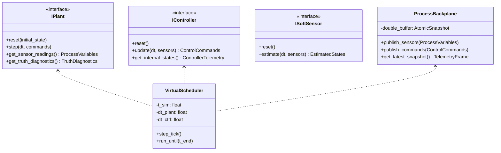

# Multiphysics Modeling, Asymmetric Hydraulics, Mechanistic Milling & Adaptive Control Architecture

**Engineering Design Specification & Mathematical Foundations**  
*Project: Hydraulically Pushed Inconel 718 Milling Simulator & Research Workstation*

---

## 1. System Overview & Physical Problem Formulation

### 1.1 Mechanical & Kinematic Architecture
The system consists of an axial robotic milling apparatus designed for heavy-duty metal removal on high-strength superalloy targets. The apparatus comprises two primary electromechanical/hydraulic subsystems:

1. **The Hydraulic Pusher Assembly**:
   - A rigid cylindrical housing anchoring a variable-speed centrifugal pump driven by a primary Permanent Magnet Synchronous Motor (**PMSM 1**).
   - The pump discharges fluid into a single-acting hydraulic cylinder chamber.
   - A piston and extending rod assembly of effective mass $M_{eff}$ and cross-sectional area $A_p$ extends forward under chamber pressure $P$.
   - **Crucial Asymmetry**: The hydraulic circuit lacks an active two-way proportional directional valve or quick-dump mechanism. Pumping builds pressure rapidly, but the centrifugal pump cannot generate negative flow against positive chamber pressure ($Q_{pump} \ge 0$). A small, stiff calibrated bypass orifice and parasitic seal clearances provide a very slow passive leakage path ($Q_{bypass}$ and $Q_{leak}$). Consequently, **hydraulic pressure (which acts as the normal driving force behind Weight-On-Bit) can only relax rapidly if the milling cutter actively removes target material ($\dot{x} > 0$), allowing the chamber volume to expand.**
2. **The Milling Head & Workpiece Assembly**:
   - Mounted at the distal end of the extending rod is a high-speed milling spindle powered by a secondary Permanent Magnet Synchronous Motor (**PMSM 2**).
   - The spindle rotates a cylindrical milling tool (end mill / burr) of radius $R_{bit}$ with $Z$ flutes.
   - The tool engages an Inconel 718 spherical workpiece of radius $R_{sphere}$.
   - Both motors are equipped with high-resolution resolvers and driven by Field-Oriented Control (FOC) inverters.
   - Spindle cutting torque is inferred in real-time from the quadrature-axis current ($I_q$) of PMSM 2.

```
+-------------------------------------------------------------------------------------------------------+
|                                    HYDRAULIC PUSHER ASSEMBLY                                          |
|                                                                                                       |
|   +---------------+     +------------------+         Hydraulic Line           +-------------------+   |
|   |    PMSM 1     |===> | Centrifugal Pump |================================> | Cylinder Chamber  |   |
|   |  Pump Motor   |     |    H-Q Curve     |           Pressure P             |  Capacitance C_h  |   |
|   +---------------+     +------------------+                                  +---------+---------+   |
|                                                      Stiff Bypass Orifice Q_bypass      |             |
|                                                      [========  ||  ========]           |             |
|                                                                                         v             |
|                                                                                   +-----------+       |
|                                                                                   |  Piston   | ===\  |
|                                                                                   |  Area A_p |    |  |
|                                                                                   +-----------+    |  |
|                                                                                 Stribeck Friction  |  |
|                                                                                   F_fric(P, v)     |  |
+----------------------------------------------------------------------------------------------------|--+
                                                                                                     |
                                                                                                     | Extending
                                                                                                     | Rod
                                                                                                     v
+----------------------------------------------------------------------------------------------------+--+
|                                    MILLING ASSET & WORKPIECE                                       |
|                                                                                                    |
|            +---------------+     +----------------+     +-------------------+                      |
|            |    PMSM 2     |===> | Spindle Shaft  |===> |  Cylindrical Bit  |                      |
|            | Spindle Motor |     |  Compliance    |     | Radius R_b, Z fl. |                      |
|            +---------------+     +----------------+     +---------+---------+                      |
|               Resolver &                                          | Instantaneous                  |
|               FOC I_q Sens.                                       | Engagement d(t)                |
|                                                                   v                                |
|                                                         ((((((((((((((((((                         |
|                                                         ( Inconel 718    (                         |
|                                                         ( Target Sphere  (                         |
|                                                         ((((((((((((((((((                         |
+----------------------------------------------------------------------------------------------------+
```

---

## 2. Mathematical Modeling of the Multiphysics Plant

### 2.1 Centrifugal Pump & Hydraulic Dynamics
The centrifugal pump does not dictate pressure directly. It establishes a pressure head governed by Euler's turbomachinery equation, characterized by an empirical second-order polynomial map dependent on pump mechanical speed $\omega_p$ and volumetric discharge flow $Q$:

$$\Delta P_{pump}(\omega_p, Q) = a_0 \omega_p^2 - a_1 \omega_p Q - a_2 Q^2$$

where $a_0, a_1, a_2 > 0$ are experimentally identified pump coefficients.

#### Flow Non-Reversibility (Check-Valve Nature):
Centrifugal impellers cannot reverse flow against a positive pressure differential without severe cavitation or check-valve isolation:

$$Q_{pump}(\omega_p, P) = \begin{cases} 
\max\left(0, \frac{-a_1 \omega_p + \sqrt{(a_1 \omega_p)^2 - 4 a_2 (P - a_0 \omega_p^2)}}{-2 a_2}\right) & \text{if } a_0 \omega_p^2 > P \\ 
0 & \text{if } a_0 \omega_p^2 \le P 
\end{cases}$$

#### Fluid Compressibility & Effective Bulk Modulus:
Hydraulic mineral oil contains entrained air bubbles and operates within elastic cylinder boundaries. The effective bulk modulus $\beta_{eff}(P)$ is pressure-dependent:

$$\frac{1}{\beta_{eff}(P)} = \frac{1}{\beta_{fluid}} + \frac{\alpha_{air,0} \left(\frac{P_0}{P}\right)^{1/\gamma}}{P} + \frac{1}{K_{wall}}$$

where:
- $\beta_{fluid} \approx 1.4 \times 10^9\text{ Pa}$ is the pure fluid bulk modulus.
- $\alpha_{air,0} \approx 0.005 - 0.015$ is the volumetric air fraction at atmospheric pressure $P_0 = 1.013 \times 10^5\text{ Pa}$.
- $\gamma \approx 1.4$ is the adiabatic expansion index.
- $K_{wall} \approx 2.0 \times 10^{10}\text{ Pa}$ is cylinder structural elastance.

#### Chamber Fluid Continuity Equation:
Applying the Reynolds Transport Theorem to the forward cylinder volume $V(x) = V_0 + A_p x$:

$$\frac{dP}{dt} = \frac{\beta_{eff}(P)}{V_0 + A_p x} \left( Q_{pump}(\omega_p, P) - Q_{bypass}(P) - Q_{leak}(P) - A_p \dot{x} \right)$$

where:
- $V_0$ is the dead volume (lines, fittings, retracted cylinder volume).
- $A_p \dot{x}$ is the displacement flow induced by rod velocity $\dot{x}$.
- $Q_{bypass}(P)$ is the flow through the stiff calibrated bypass orifice:
  $$Q_{bypass}(P) = C_{bypass} \sqrt{\frac{2}{\rho} |P - P_0|} \, \text{sgn}(P - P_0)$$
  with discharge coefficient-area product $C_{bypass}$ dimensioned small enough to yield a stiff chamber, establishing a passive relaxation time constant $\tau_{leak} \approx \frac{V_0 \sqrt{2 \rho \Delta P}}{\beta_{eff} C_{bypass}} \gg 10\text{ s}$.
- $Q_{leak}(P) = C_{leak} (P - P_0)$ represents laminar piston seal bypass.

---

### 2.2 Axial Pusher Dynamics & Pressure-Dependent Seal Friction
The extending piston, rod, and milling asset form an axial mass-spring-damper system driven by hydraulic net force and opposed by seal friction and machining cutting reaction forces.

#### Equation of Axial Motion:
$$M_{eff} \ddot{x} + C_{visc} \dot{x} + F_{fric}(P, \dot{x}) + F_{c, axial} = (P - P_0) A_p$$

where:
- $M_{eff} = M_{piston} + M_{rod} + M_{asset}$ is the total moving mass.
- $C_{visc}$ is parasitic viscous drag.
- $F_{c, axial}$ is the actual axial cutting reaction force (the true **Weight-On-Bit**).

#### Pressure-Dependent Stribeck Friction:
Hydraulic U-cup and elastomer rod seals deform under hydraulic chamber pressure, forcing the contact lip harder against the honed cylinder bore. Consequently, Coulomb and breakaway friction values are functions of chamber pressure $P$:

$$\begin{aligned}
F_c(P) &= F_{c0} + \alpha_{cp} (P - P_0) \\
F_s(P) &= F_{s0} + \alpha_{sp} (P - P_0)
\end{aligned}$$

The dynamic friction force is formulated via a generalized Stribeck curve with continuous tanh regularization for zero-velocity zero-crossing:

$$F_{fric}(P, \dot{x}) = \left[ F_c(P) + \left( F_s(P) - F_c(P) \right) e^{-\left|\frac{\dot{x}}{v_s}\right|^\delta} \right] \tanh\left(\frac{\dot{x}}{v_{trans}}\right) + \sigma_v(P) \dot{x}$$

where:
- $v_s$ is the characteristic Stribeck velocity.
- $\delta \in [1, 2]$ is the Stribeck shape exponent.
- $v_{trans} \approx 10^{-4}\text{ m/s}$ ensures smooth numerical differentiation across zero velocity.
- $\sigma_v(P) = \sigma_{v0} + \alpha_{vp} P$ is the pressure-dependent viscous seal coefficient.

#### Decoupling Pressure from Weight-On-Bit (WOB):
Notice from the axial equation of motion:

$$F_{c, axial} = (P - P_0) A_p - F_{fric}(P, \dot{x}) - M_{eff} \ddot{x} - C_{visc} \dot{x}$$

**Hydraulic pressure is NOT identical to Weight-On-Bit.** At static stick ($v = 0$), $F_{fric}$ can balance substantial pressure before motion occurs. In high-speed milling, dynamic seal friction and rod acceleration account for 10%–35% of the total hydraulic force. A dedicated **Soft WOB Observer** is required.

---

### 2.3 Mechanistic 3D Milling Mechanics (Inconel 718)
The milling bit is a cylindrical flat-end/helical cutter engaging a curved Inconel 718 sphere. This setup departs fundamentally from standard Cartesian 2.5D milling because the engagement boundary and contact area expand continuously as the tool plunges into the sphere.

```
       Cylindrical Cutter                      Inconel 718 Target Sphere
       +-----------------+
       |      Bit        |                         .  - ~ ~ -  .
       |    Radius R_b   |                     . '               ' .
       |                 |                   /                     \
       |  \   \   \   \  |                  |                       |
       |   \   \   \   \ | ===> Axial Feed  |          x_c          | Radius R_s
       |    \   \   \   \|       \dot{x}    |                       |
       +--------+--------+                   \                     /
                | Crater Crater               ' .               . '
                |<-- d -->|                         '  - ~ ~ -  '
```

#### 3D Contact Geometry & Crater Evolution:
Let the cutter axis be aligned with the coordinate $x$, with cutter radius $R_{bit}$. Let the sphere center be located at $(x_c, 0, 0)$ with radius $R_{sphere}$.
- The initial contact occurs when rod position $x = x_c - R_{sphere}$.
- Plunge penetration depth:
  $$d(t) = \max\left(0, x(t) - (x_c - R_{sphere})\right)$$
- The intersection between a cylinder of radius $R_{bit}$ and a sphere of radius $R_{sphere}$ establishes an instantaneous axial contact length $z \in [0, z_{max}(d)]$ and angular tooth immersion window $\phi \in [\phi_{start}(z), \phi_{exit}(z)]$:
  $$z_{max}(d) = \min\left(d, R_{sphere} - \sqrt{\max\left(0, R_{sphere}^2 - R_{bit}^2\right)}\right)$$

#### Mechanistic Differential Cutting Forces (Altintas Model):
For flute $j \in \{1, \dots, Z\}$ at spindle rotation angle $\theta(t)$, the instantaneous tooth immersion angle is:

$$\phi_j(z, t) = \theta(t) + (j-1)\frac{2\pi}{Z} - \frac{z \tan \beta_{helix}}{R_{bit}}$$

The uncut chip thickness $h_j(\phi_j, z)$ normal to the cutting edge depends on axial feed velocity $\dot{x}$ and spindle rotational speed $\omega_{bit}$:

$$h_j(\phi_j, z) = \frac{2\pi \dot{x}}{Z \omega_{bit}} \sin(\phi_j) = f_z \sin(\phi_j)$$

where $f_z = \frac{\dot{x}}{Z n_{bit}}$ is feed per tooth. If $\sin(\phi_j) \le 0$ or flute $j$ is outside the active geometric engagement envelope, $h_j = 0$.

The elemental cutting forces acting in tangential ($t$), radial ($r$), and axial ($a$) directions on an axial slice $dz$ are formulated through shear and ploughing/edge coefficients:

$$\begin{aligned}
dF_{t,j}(\phi_j, z) &= \left[ K_{tc} h_j(\phi_j, z) + K_{te} \right] dz \\
dF_{r,j}(\phi_j, z) &= \left[ K_{rc} h_j(\phi_j, z) + K_{re} \right] dz \\
dF_{a,j}(\phi_j, z) &= \left[ K_{ac} h_j(\phi_j, z) + K_{ae} \right] dz
\end{aligned}$$

where for Inconel 718:
- $K_{tc} \approx 2800 - 3400\text{ N/mm}^2$ (very high shear energy due to Ni-Cr austenitic matrix and work hardening).
- $K_{te} \approx 45 - 85\text{ N/mm}$ (intense edge rubbing and flank wear).
- $K_{rc} \approx 1100 - 1600\text{ N/mm}^2$, $K_{re} \approx 35 - 65\text{ N/mm}$.
- $K_{ac} \approx 650 - 950\text{ N/mm}^2$, $K_{ae} \approx 25 - 50\text{ N/mm}$.

#### Integration to Spindle Torque & Axial Thrust:
Transforming elemental forces into the machine frame:
- Instantaneous Spindle Cutting Torque:
  $$T_{cutting}(t) = \sum_{j=1}^Z \int_{0}^{z_{max}} dF_{t,j}(\phi_j(z, t), z) \cdot R_{bit}$$
- Instantaneous Axial Reaction Force ($F_{c, axial}$):
  $$F_{c, axial}(t) = \sum_{j=1}^Z \int_{0}^{z_{max}} dF_{a,j}(\phi_j(z, t), z)$$

#### Multi-Fidelity Models:
1. **Level A (Control-Oriented / Revolution-Averaged)**:
   Averages high-frequency tooth-passing harmonics over a full spindle revolution. The projected contact area $A_{proj}(d) \approx \pi (2 R_{sphere} d - d^2)$ and volumetric Material Removal Rate (MRR) govern the mean dynamics:
   $$\text{MRR}(t) = A_{proj}(d(t)) \cdot \dot{x}(t)$$
   $$\bar{T}_{cutting} = \bar{K}_{c} \cdot \frac{\text{MRR}(t)}{\omega_{bit}(t)} + T_{edge} A_{proj}(d)$$
   $$\bar{F}_{c, axial} = \bar{K}_{ax} \cdot A_{proj}(d(t)) + C_{cut} \dot{x}(t)$$
   *Use Case*: Fast batch SysID sweeps, Monte Carlo parameter robustness studies, real-time control execution.
2. **Level B (Disturbance-Rich / Tooth-Resolved)**:
   Integrates instantaneous tooth passing, cutter runout eccentricity $r_j = R_{bit} + \epsilon \cos(j \frac{2\pi}{Z})$, and micro-impact chatter.
   *Use Case*: Validating filter robustness, observer ripple rejection, and state-machine chatter triggers.

---

### 2.4 PMSM Drive Dynamics & FOC Iq Torque Derivation
Both the pump drive and spindle drive utilize 3-phase Permanent Magnet Synchronous Motors with resolver angle feedback, controlled by closed-loop Field-Oriented Control (FOC).

#### $d-q$ Axis Rotor Equations:
$$\begin{aligned}
\frac{di_d}{dt} &= \frac{1}{L_d} \left( v_d - R_s i_d + \omega_e L_q i_q \right) \\
\frac{di_q}{dt} &= \frac{1}{L_q} \left( v_q - R_s i_q - \omega_e L_d i_d - \omega_e \lambda_m \right)
\end{aligned}$$

where $\omega_e = p \omega_m$ ($p$ = pole pairs, $\omega_m$ = rotor mechanical speed), $\lambda_m$ is permanent magnet flux linkage, and $R_s, L_d, L_q$ are stator resistance and inductances.

#### Electromagnetic Torque:
For a surface-mounted PMSM ($L_d \approx L_q$):

$$T_{em} = \frac{3}{2} p \lambda_m i_q$$

Under high-performance FOC, $i_d$ is regulated to zero ($i_d^{ref} = 0$).

#### Mechanical Spindle Rotor Dynamics:
$$J_m \frac{d\omega_{spindle}}{dt} + B_m \omega_{spindle} = T_{em} - T_{cutting}$$

#### Resolver & Sensor Emulation:
The resolver angle $\theta_{res}$ is tracked via a 2nd-order Phase-Locked Loop (PLL) tracking observer:

$$\frac{d\hat{\theta}}{dt} = \hat{\omega} + K_{p,pll} e_{\theta}, \quad \frac{d\hat{\omega}}{dt} = K_{i,pll} e_{\theta}$$

where $e_{\theta} = \sin(\theta_{true} - \hat{\theta}) + \mathcal{N}(0, \sigma_{\theta}^2)$ incorporates high-frequency resolver ripple and 14-bit quantization.

#### Controller-Visible Torque Soft Sensor:
The plant exposes an estimated spindle load torque derived directly from the measured $i_q$ current through a calibrated low-pass filter:

$$\hat{T}_{spindle}(s) = \frac{1}{\tau_{iq} s + 1} \left[ \frac{3}{2} p \lambda_m i_q(t) \right] - J_m \frac{d\hat{\omega}}{dt} - B_m \hat{\omega}$$

---

## 3. The Pressure Trapping Phenomenon & Actuator Asymmetry

### 3.1 Mathematical Formulation of Actuator Non-Symmetry
Consider the hydraulic pressure continuity equation when the controller attempts to rapidly drop pressure ($P \to P_{target} < P_{current}$):

$$\frac{dP}{dt} = \frac{\beta_{eff}(P)}{V_0 + A_p x} \left( Q_{pump}(\omega_p, P) - Q_{bypass}(P) - Q_{leak}(P) - A_p \dot{x} \right)$$

When the controller drops pump speed $\omega_p \to \omega_{min} \approx 0$, the pump check-valve behavior forces $Q_{pump} = 0$. The rate of pressure decay becomes:

$$\left. \frac{dP}{dt} \right|_{\omega_p = 0} = -\frac{\beta_{eff}(P)}{V(x)} \underbrace{\left[ Q_{bypass}(P) + Q_{leak}(P) \right]}_{\text{Very small (stiff orifice)}} - \frac{\beta_{eff}(P)}{V(x)} \underbrace{A_p \dot{x}}_{\text{Material Removal Feed}}$$

### 3.2 Phase-Plane Analysis
- **Case 1: Spindle is Stationary or Stalled ($\dot{x} = 0$)**:
  $$\frac{dP}{dt} = -\frac{\beta_{eff}(P)}{V(x)} Q_{bypass}(P) \approx -\frac{1.4 \times 10^9}{1.5 \times 10^{-4}} \left( 1.2 \times 10^{-7} \right) \approx -1.1\text{ bar/sec}$$
  It takes over **45 seconds** for a 50 bar pressure head to bleed down passively!
- **Case 2: Spindle is Actively Cutting ($\dot{x} > 0$)**:
  As the bit cuts Inconel 718 at feed velocity $\dot{x} = 0.5\text{ mm/s} = 5 \times 10^{-4}\text{ m/s}$ with piston area $A_p = 2 \times 10^{-3}\text{ m}^2$:
  $$A_p \dot{x} = 10^{-6}\text{ m}^3\text{/s}$$
  $$\frac{dP}{dt} \approx -\frac{1.4 \times 10^9}{1.5 \times 10^{-4}} \left( 10^{-6} \right) \approx -9.3\text{ bar/sec}$$
  Pressure relaxes **an order of magnitude faster** when material is actively milled away!

### 3.3 Failure Modes of Classical Controllers
If a standard PID controller is placed around pressure or spindle torque:
1. When contact occurs, cutting torque spikes due to Inconel 718 work hardening.
2. The error $e = T_{target} - T_{meas}$ becomes strongly negative.
3. The PID integrator commands $\omega_{pump} \to 0$.
4. **However, pressure and torque do not drop immediately.**
5. The PID error continues to integrate negatively, winding up the integrator to its negative saturation limit.
6. The cutter bogs down, spindle speed crashes ($\omega_{spindle} \to 0$), feed stops ($\dot{x} \to 0$), and pressure becomes completely trapped.
7. The bit stalls permanently under extreme static load, breaking tool flutes or triggering inverter overcurrent shutdown.

---

## 4. Control System Architecture & Algorithms

### 4.1 Layered Control Hierarchy

```
+----------------------------------------------------------------------------------------------------+
| Layer 4: Supervisory Hybrid State Machine                                                         |
| [APPROACH] -> [CONTACT_ACQUISITION] -> [NORMAL_MILLING] <-> [PRESSURE_RELAXATION]                 |
|                                                              \-> [OVERLOAD_RECOVERY / STALL]       |
+----------------------------------------------------------------------------------------------------+
                                                  | State & Supervisory Constraints
                                                  v
+----------------------------------------------------------------------------------------------------+
| Layer 3: Milling Load Governor & CNC Handbook Optimizer                                            |
| Calculates safe chip load f_z, surface speed v_c -> Spindle RPM setpoint omega_bit_ref             |
| Computes allowable normal force envelope F_wob_max based on Inconel 718 shear limits               |
+----------------------------------------------------------------------------------------------------+
                                                  | Modulated Force/Pressure Reference r(t)
                                                  v
+----------------------------------------------------------------------------------------------------+
| Layer 2: Cascade Linear ADRC (Active Disturbance Rejection Control)                               |
|   +---------------------------------------+    +-----------------------------------------------+   |
|   | 3rd-Order Linear Extended State Obs.  |    | Asymmetric Reference Governor & Anti-Windup   |   |
|   | (LESO) estimates total disturbance    |    | Clamps positive slew rate; freezes observer   |   |
|   | z_3 = f(t) (friction + curvature)     |    | during torque overload                        |   |
|   +---------------------------------------+    +-----------------------------------------------+   |
|   Control Law: u_pump = (u_0 - z_3) / b_0                                                          |
+----------------------------------------------------------------------------------------------------+
                                                  | Actuator Commands (omega_pump_cmd, omega_bit_cmd)
                                                  v
+----------------------------------------------------------------------------------------------------+
| Layer 1: Actuator Rate Limiters & Hardware Envelopes                                               |
+----------------------------------------------------------------------------------------------------+
                                                  |
                                                  v
+----------------------------------------------------------------------------------------------------+
| Layer 0: Embedded PMSM FOC & Resolver Loops (10 kHz current, 1 kHz speed)                          |
+----------------------------------------------------------------------------------------------------+
```

---

### 4.2 Supervisory State Machine

| State | Entry Condition | Active Control Strategy | Exit Condition |
| :--- | :--- | :--- | :--- |
| **`APPROACH`** | Initial startup | Fast rod feed ($\omega_p = \omega_{approach}$); bit spinning at nominal $v_c$ | $P > P_{threshold}$ OR $\hat{T}_{spindle} > T_{noise}$ |
| **`CONTACT_ACQUISITION`**| Contact detected | Pump speed clamped to minimum creep speed; verify contact | $d > 0.05\text{ mm}$ AND $\hat{T}_{spindle}$ stable |
| **`NORMAL_MILLING`** | Stable cut verified | Cascade LADRC active; regulating WOB / torque | $\hat{T}_{spindle} > T_{max}$ OR $P > P_{max}$ |
| **`PRESSURE_RELAXATION`**| Torque overload | Pump commanded to idle ($\omega_p = 0$); spindle maintains RPM; allow cut to clear material | $\hat{T}_{spindle} < T_{safe}$ AND $P < P_{safe}$ |
| **`OVERLOAD_RECOVERY`** | Spindle speed droop $> 25\%$ | Pump cut to zero; spindle commanded to maximum recovery torque | $\omega_{spindle} > 0.9 \omega_{nominal}$ |
| **`STALL_RECOVERY`** | $\omega_{spindle} < \omega_{stall}$ | Emergency pump back-off; spindle shut down and re-indexed | Operator manual reset or automated retract |

---

### 4.3 Soft Weight-On-Bit (WOB) Observer
Direct dynamic estimation of cutting thrust without requiring an expensive, fragile in-situ load cell:

$$\hat{F}_{wob}(k) = \left[ P_{meas}(k) - P_0 \right] A_p - \hat{F}_{fric}\left(P_{meas}(k), \hat{v}_{rod}(k)\right) - M_{eff} \hat{a}_{rod}(k)$$

where $\hat{v}_{rod}$ and $\hat{a}_{rod}$ are obtained from a discrete kinematic tracking filter:

$$\begin{aligned}
e_{x}(k) &= x_{meas}(k) - \hat{x}(k|k-1) \\
\hat{x}(k) &= \hat{x}(k|k-1) + g_1 e_x(k) \\
\hat{v}(k) &= \hat{v}(k|k-1) + g_2 e_x(k) \\
\hat{a}(k) &= \hat{a}(k|k-1) + g_3 e_x(k)
\end{aligned}$$

---

### 4.4 Cascade Linear Active Disturbance Rejection Control (LADRC)
ADRC is the mathematically optimal choice for this plant because it does not require an exact analytical equation for the expanding Inconel 718 spherical contact area or nonlinear friction. It lumps all unknown dynamics into a single "total disturbance" $f(t)$ and estimates it in real-time.

#### Plant Canonical Representation:
$$\ddot{y} = f(y, \dot{y}, w, t) + b_0 u$$

where:
- $y = P$ (or estimated WOB $\hat{F}_{wob}$).
- $u = \omega_{pump}^2$ (linearized pump input).
- $f(t)$ encapsulates nonlinear Stribeck friction transitions, bulk modulus variations, Inconel 718 work hardening, and geometric spherical expansion.
- $b_0 \approx \frac{\beta_{eff} a_0}{V_0}$ is the high-frequency control gain.

#### Discrete 3rd-Order Linear Extended State Observer (LESO):
Let the state vector be $x = [z_1, z_2, z_3]^T = [y, \dot{y}, f]^T$. The discrete observer equations over sample period $h = \Delta t_{ctrl} = 0.01\text{ s}$ are:

$$\hat{z}(k) = A_d \hat{z}(k-1) + B_d u(k-1) + L_d \left( y(k) - C_d A_d \hat{z}(k-1) \right)$$

where the observer gain vector $L_d$ is parameterized via a single tuning parameter, the **observer bandwidth $\omega_o$**:

$$\det(z I - (A_d - L_d C_d A_d)) = (z - e^{-\omega_o h})^3$$

#### Control Law with Asymmetric Reference Governor (ARG):
$$u_0(k) = k_p \left( r_{gov}(k) - \hat{z}_1(k) \right) - k_d \hat{z}_2(k)$$
$$u_{unclamped}(k) = \frac{u_0(k) - \hat{z}_3(k)}{b_0}$$
$$u_{cmd}(k) = \max\left(0, \min\left(u_{unclamped}(k), (\omega_{pump}^{max})^2\right)\right)$$

where controller gains are tuned via controller bandwidth $\omega_c$:
$$k_p = \omega_c^2, \quad k_d = 2 \xi \omega_c \quad (\xi = 1.0)$$

#### Asymmetric Reference Governor Rules:
1. **Positive Slew Limit**: $\Delta r^+ \le \dot{P}_{max}^+ \cdot h$ (prevents pumping faster than the cutter can establish chip clearance).
2. **Torque-Sensitive Backoff**:
   If $\hat{T}_{spindle} > T_{threshold}$:
   $$r_{gov}(k) = \max\left(P_{min}, r_{gov}(k-1) - \gamma_{backoff} (\hat{T}_{spindle} - T_{threshold})\right)$$
3. **Anti-Windup Observer Freeze**:
   If $u_{unclamped} < 0$ (attempting to pull negative flow), the observer disturbance update is held:
   $$\hat{z}_3(k) \leftarrow \hat{z}_3(k-1)$$
   preventing the observer from integrating non-existent actuator authority.

---

### 4.5 Evaluation of Control Packages & Alternative Candidates

#### Python Libraries Assessment:
- **`python-control`**: The premier open-source library for continuous and discrete control system analysis in Python. In this project, `python-control` is utilized for:
  1. Validating pole-placement matrices $A_d, B_d, L_d$ for the LESO.
  2. Computing frequency-domain loop gains $L(j\omega)$, sensitivity functions $S(j\omega)$, and complementary sensitivity $T(j\omega)$ to establish gain/phase margins.
  3. Continuous-to-discrete conversions using exact Zero-Order Hold (ZOH) mapping.
- **`adrc` / `pyadrc`**: Standard implementations exist on PyPI. However, commercial ADRC packages assume symmetric control authority ($\pm u_{max}$). For this project, a dedicated, zero-dependency, mathematically transparent discrete LADRC class is implemented in `sim/controller/adrc.py` with custom asymmetric governors, while providing an adapter interface compatible with `pyadrc`.

#### Controller Comparison Matrix:

| Metric | Gain-Scheduled Baseline PID | Cascade LADRC (Selected) | Constrained NMPC | MRAC (Model Ref Adaptive) |
| :--- | :--- | :--- | :--- | :--- |
| **Model Dependency** | Low (heuristic tuning) | **Low-Medium** ($\omega_o, \omega_c, b_0$) | High (requires full ODE model) | High (requires matching condition) |
| **Handling of Trapped Pressure**| Poor (severe windup) | **Excellent** (via Reference Governor) | Excellent (explicit inequality bounds)| Poor (parameter divergence on saturation)|
| **Computational Footprint** | $< 0.05\text{ ms}$ | **$< 0.1\text{ ms}$ (ideal for 100 Hz)**| $5 - 25\text{ ms}$ (requires QP/SQP solver)| $0.2 - 0.5\text{ ms}$ |
| **Inconel 718 Hardness Adaptation**| None | **Immediate** (absorbed into $f(t)$) | Moderate | Fast but susceptible to bursting |
| **Implementation Complexity**| Very Low | **Moderate** | Very High | High |

---

## 5. System Identification (SysID) & Design of Experiments (DoE)

To ensure high fidelity, the simulation parameters must not be guessed from handbooks. We establish a staged, orthogonal identification workflow.

```
+----------------------------------------------------------------------------------------------------+
| Stage 1: Electrical & Drive Identification (PMSM 1 & 2)                                            |
| Test: Uncoupled speed chirps & step load. Identify: J_m, B_m, lambda_m, inverter delay tau_inv      |
+----------------------------------------------------------------------------------------------------+
                                                  |
                                                  v
+----------------------------------------------------------------------------------------------------+
| Stage 2: Hydraulic Subsystem Identification (No Contact / Deadheaded)                             |
| Test: Multi-step pump speeds -> measure P_hyd rise and decay.                                     |
| Identify: a_0, a_1, a_2 (H-Q curve), beta_eff (compressibility), C_bypass (stiff orifice flow)      |
+----------------------------------------------------------------------------------------------------+
                                                  |
                                                  v
+----------------------------------------------------------------------------------------------------+
| Stage 3: Pusher Mechanics & Pressure-Dependent Seal Friction                                       |
| Test: Constant-velocity extending strokes at varying chamber pressures P.                          |
| Identify: F_c0, F_s0, alpha_cp, alpha_sp, v_s, sigma_v (Stribeck parameters)                       |
+----------------------------------------------------------------------------------------------------+
                                                  |
                                                  v
+----------------------------------------------------------------------------------------------------+
| Stage 4: Mechanistic Cutting Force Identification (Inconel 718 Workpiece)                         |
| Test: Controlled orthogonal & face milling cuts across feed per tooth f_z and depth of cut d.     |
| Identify: K_tc, K_te, K_rc, K_re, K_ac, K_ae (mechanistic shear and edge coefficients)             |
+----------------------------------------------------------------------------------------------------+
                                                  |
                                                  v
+----------------------------------------------------------------------------------------------------+
| Stage 5: Closed-Loop Model Validation on Held-Out Irregular Feed Datasets                          |
+----------------------------------------------------------------------------------------------------+
```

### 5.1 Parameter Identification Equations & Cost Functions
For each stage $s$, parameter vector $\theta_s$ is estimated via nonlinear weighted least-squares with Levenberg-Marquardt optimization (`scipy.optimize.least_squares`):

$$\min_{\theta_s} J(\theta_s) = \sum_{k=1}^N \left( y_{meas}(t_k) - y_{sim}(t_k; \theta_s) \right)^T W \left( y_{meas}(t_k) - y_{sim}(t_k; \theta_s) \right) + \lambda \|\theta_s - \theta_{prior}\|^2$$

subject to physical parameter bound constraints $\theta_{min} \le \theta_s \le \theta_{max}$.

---

## 6. Software Architecture & In-Memory Process Backplane

### 6.1 Prime Architectural Principle: Deterministic Virtual-Time
The numerical simulation engine **never** allows operating system thread schedulers to dictate simulation time or step intervals. All physical integration steps and discrete controller cycles advance via an explicit, reproducible virtual clock $t_{sim}$.

```
Virtual Clock: t_sim = 0.000 s
[Plant Step 1 ms] -> [Plant Step 2 ms] ... -> [Plant Step 10 ms: Controller Triggered]
```

### 6.2 Class Structure & Contracts (OOP Interfaces)



### 6.3 Threading & Asynchronous Boundaries
- **Numerical Core**: Runs synchronously inside `VirtualScheduler`. Executes Level A or Level B plant physics at $1000\text{ Hz}$ and controller logic at $100\text{ Hz}$.
- **Real-Time Pacing Thread** (*Optional*): Used only during live UI demo mode. Regulates virtual time advancement to match wall-clock time ($1\times$ or $N\times$) using high-precision OS timers.
- **Telemetry Streaming Task**: Decimates backplane data to $30\text{ Hz} - 60\text{ Hz}$ and broadcasts JSON/Protobuf packets over WebSockets to connected UI clients.
- **File Logging Task**: Asynchronously buffers frames into Apache Parquet / CSV files without blocking simulation math.

---

## 7. Modern Technical Light UI Workstation Specification

### 7.1 Visual Philosophy & Laboratory Aesthetic
The user interface is engineered as a clean, high-precision technical workstation tailored for scientific reporting, academic battery research, technical documentation, and presentation-ready chart exports:
- **Palette**:
  - Main Background: Crisp off-white (`#f8fafc`).
  - Card & Container Surface: Pure white (`#ffffff`) with hairline borders (`#e2e8f0`).
  - Brand & Interactive Accent: Deep cobalt blue (`#2563eb`).
  - Values & Metrics: Slate-900 (`#0f172a`) in tabular lining numerals (`font-variant-numeric: tabular-nums`).
  - Subtitles & Labels: Slate-500 (`#64748b`) in uppercase tracking font.
  - State Indicators: Emerald (`#059669`) for Normal, Amber (`#d97706`) for Relaxation, Rose (`#e11d48`) for Overload.

### 7.2 UI Layout Structure

```
+-------------------------------------------------------------------------------------------------------+
|  [Logo] MILLING RESEARCH WORKSTATION    Mode: [NORMAL_MILLING]   t_sim: 14.280s   [Play][Step][E-Stop] |
+-----------+-------------------------------------------------------------------------------------------+
| SIDEBAR   | KPI STRIP: P_hyd: 42.1 bar | WOB: 812 N | Torque: 4.8 N*m | RPM: 4250 | MRR: 38.4 mm3/s   |
|           +---------------------------------------------+---------------------------------------------+
| - Live    | 3D KINEMATIC VIEWPORT                       | VECTOR STRIP CHARTS (Chart.js / Canvas)     |
|   Monitor | - Three.js WebGL Viewport                   | [P_hyd & WOB Est vs Time]                   |
| - Compare | - Hydraulic Pusher Cylinder                 |                                             |
|   Modes   | - Extending Piston & Rod                    | [Spindle Torque & Iq Current vs Time]       |
| - SysID & | - Spinning Fluted Cutter                    |                                             |
|   DoE     | - Inconel 718 Target Sphere                 | [LESO Disturbance Estimate z_3 vs Time]     |
| - Data    | - Dynamic Crater Deposition                 |                                             |
|   Export  | - Colorized Contact Stress Heatmap          | [Action: Export SVG / PNG / CSV]            |
|           +---------------------------------------------+---------------------------------------------+
|           | CONTROL PARAMETERS & MANUAL OVERRIDES                                                     |
|           | Slider: Inconel Hardness (HRC) | Slider: Bypass Orifice Conductance | Controller Selector      |
+-----------+-------------------------------------------------------------------------------------------+
```

---

## 8. Verification, Testing & Acceptance Matrix

| Module | Verification Test | Analytical Benchmark / Acceptance Criteria |
| :--- | :--- | :--- |
| **Hydraulics** | `tests/test_hydraulics.py` | Non-reversibility: With $\omega_p=0$ and $\dot{x}=0$, $\left.\frac{dP}{dt}\right\|_{leak} \le 0$ with $\tau \ge 25\text{ s}$. Bulk modulus compression matches isothermal/adiabatic fluid limits within $1\%$. |
| **Mechanics** | `tests/test_mechanics.py` | Breakaway force scaling: $F_s(P)$ increases with $P$ with slope $\alpha_{sp} = 0.015\text{ N/Pa} \pm 5\%$. Stick-slip hysteresis displays zero velocity limit cycling. |
| **Cutting Mechanics** | `tests/test_cutting.py` | Analytical spherical cap volume $V(d) = \frac{\pi d^2}{3}(3 R_s - d)$ matches numerical removal within $0.1\%$. Specific cutting power $P_c = T_c \omega_{bit}$ remains non-negative. |
| **Virtual Scheduler** | `tests/test_scheduler.py` | Determinism: Two successive runs with randomized thread scheduling produce identical 64-bit IEEE 754 floating-point trajectories across $10^5$ ticks. |
| **ADRC vs PID** | `tests/test_controller.py` | Overload step response: Cascade LADRC successfully backs off pump speed and limits peak torque to $< 1.15 T_{limit}$, whereas baseline PID without asymmetric governor causes spindle stall ($\omega_{spindle} \to 0$). |
